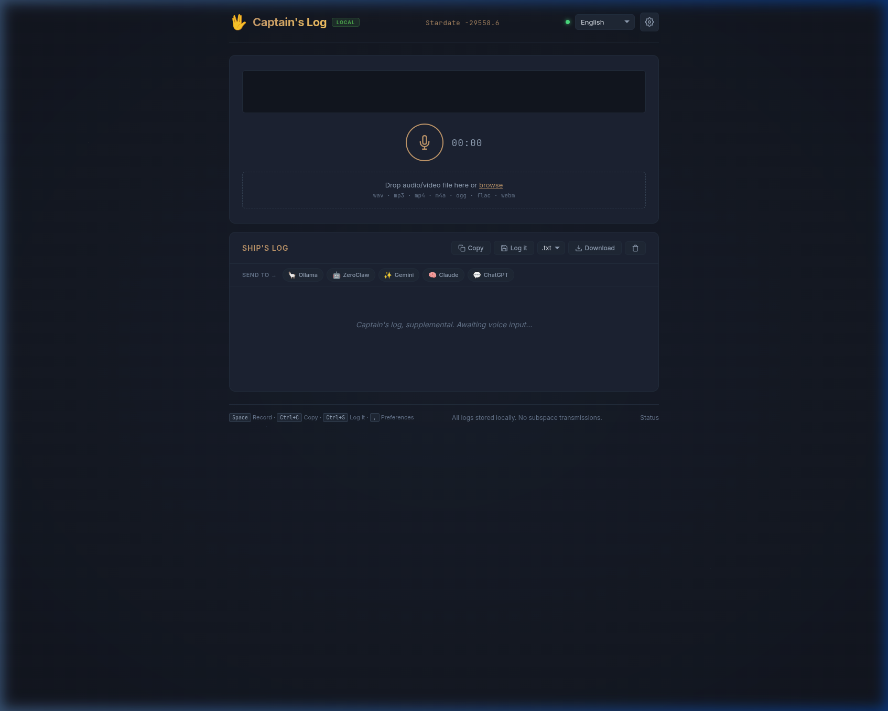

# 🖖 Captain's Log

**Turn your voice into text — privately, on your own computer.**

No cloud services. No accounts. No data ever leaves your machine.

Hit record, talk, get text. That's it.



---

## Quick Install

### One-line install (Linux/macOS)

```bash
curl -fsSL https://raw.githubusercontent.com/ryan-winkler/captainslog-whisper/main/install.sh | bash
```

This downloads, builds, and installs everything. It'll guide you through each step.

> **Prerequisite:** You need [Go](https://go.dev/dl/) installed first. The installer will tell you if it's missing.

### Manual install (3 steps)

<details>
<summary>Click to expand manual instructions</summary>

**Step 1: Start a transcription engine**

Captain's Log uses [Whisper](https://github.com/openai/whisper) (an open-source speech recognition model) to turn your voice into text. You need to run it separately:

```bash
# If you have Docker installed:
docker run -d -p 5000:5000 ghcr.io/heimoshuiyu/whisper-fastapi:latest

# Have a GPU? Add --gpus all for much faster transcription:
docker run -d -p 5000:5000 --gpus all ghcr.io/heimoshuiyu/whisper-fastapi:latest
```

> **No Docker?** You can also install it with pip:
> ```bash
> pip install faster-whisper fastapi uvicorn
> uvicorn whisper_fastapi:app --host 0.0.0.0 --port 5000
> ```

**Step 2: Build Captain's Log**

```bash
git clone https://github.com/ryan-winkler/captainslog-whisper.git
cd captainslog-whisper
go build -o captainslog ./cmd/captainslog
```

> **Need Go?** Download from [go.dev/dl](https://go.dev/dl/) — it's one file, no complicated setup.

**Step 3: Run it**

```bash
./captainslog
```

Open **http://localhost:8090** in your browser. Hit the mic button and talk. That's it.

</details>

### Start on boot

```bash
cp captainslog ~/.local/bin/
cp examples/captainslog.service ~/.config/systemd/user/
systemctl --user enable --now captainslog
```

---

## How It Works

Captain's Log connects to two optional services. You need the first one; the second is a bonus.

| | 🎙️ Transcription Engine | 🤖 AI Assistant |
|---|---|---|
| **What** | Whisper (speech-to-text) | LLM (text cleanup / summarization) |
| **Role** | The **ears** — turns your voice into text | The **brain** — polishes what you said |
| **Required** | **Yes** — core function | **Yes** — post-processing built in |
| **Examples** | whisper-fastapi, faster-whisper, Insanely Fast Whisper | Ollama, LM Studio, any OpenAI-compatible API |
| **Configure** | Settings → Connections → Whisper Server URL | Settings → Connections → Enable AI Assistant |

---

## Supported Transcription Backends

Captain's Log works with any backend that speaks the OpenAI `/v1/audio/transcriptions` API. Here are your options:

### Quick Start (Docker)

```bash
# Standard — works everywhere
docker run -d -p 5000:5000 ghcr.io/heimoshuiyu/whisper-fastapi:latest

# With NVIDIA GPU — much faster
docker run -d -p 5000:5000 --gpus all ghcr.io/heimoshuiyu/whisper-fastapi:latest

# Distil-Whisper — 6x faster, 49% smaller, ~1% WER (English)
docker run -d -p 5000:5000 --gpus all \
  -e WHISPER_MODEL=distil-whisper/distil-large-v3 \
  ghcr.io/heimoshuiyu/whisper-fastapi:latest
```

### Backend Comparison

| Backend | GPU | Speed | Docker | Notes |
|---|---|---|---|---|
| [whisper-fastapi](https://github.com/heimoshuiyu/whisper-fastapi) | NVIDIA/CPU | ⭐⭐⭐ | ✅ | Default, battle-tested |
| [faster-whisper-server](https://github.com/fedirz/faster-whisper-server) | NVIDIA/CPU | ⭐⭐⭐⭐ | ✅ | CTranslate2 optimized |
| [Distil-Whisper](https://huggingface.co/distil-whisper) models | NVIDIA/CPU | ⭐⭐⭐⭐⭐ | ✅ | 6x faster, use with any backend above |
| [Wyoming Faster Whisper ROCm](https://github.com/Donkey545/wyoming-faster-whisper-rocm) | **AMD** | ⭐⭐⭐⭐ | ✅ | AMD GPU support via ROCm + Wyoming protocol |
| [Insanely Fast Whisper](https://github.com/Vaibhavs10/insanely-fast-whisper) | NVIDIA/MPS | ⭐⭐⭐⭐⭐ | ❌ (CLI) | Flash Attention 2, 150min in <98s |

### Distil-Whisper Models

Distil-Whisper is a distilled version of Whisper — **6x faster, 49% smaller, within 1% WER**. English only (multilingual coming). Select these in Settings → Model:

| Model | Size | Speed | Quality |
|---|---|---|---|
| `distil-whisper/distil-large-v3` | 756M | ⭐⭐⭐⭐⭐ | Best distilled |
| `distil-whisper/distil-large-v2` | 756M | ⭐⭐⭐⭐⭐ | Stable alternative |
| `distil-whisper/distil-medium.en` | 394M | ⭐⭐⭐⭐ | Good balance |
| `distil-whisper/distil-small.en` | 166M | ⭐⭐⭐ | Lowest memory |

### Insanely Fast Whisper (CLI)

If you have an NVIDIA GPU or Apple Silicon, [Insanely Fast Whisper](https://github.com/Vaibhavs10/insanely-fast-whisper) offers the fastest transcription available — 150 minutes of audio in under 98 seconds:

```bash
# Install
pipx install insanely-fast-whisper

# Use with Distil-Whisper for maximum speed
insanely-fast-whisper --model-name distil-whisper/distil-large-v3 --file-name audio.wav
```

### Using a Remote Server

Captain's Log doesn't need Whisper running on the same computer. Point it at any machine:

| Setup | Whisper URL |
|---|---|
| Same computer | `http://127.0.0.1:5000` (default) |
| Another PC on your network | `http://192.168.1.100:5000` |
| A VPS with a GPU | `http://gpu-server.example.com:5000` |
| Docker on a NAS | `http://nas.local:5000` |

Set the URL in **Settings → Connections → Whisper Server URL**, or:
```bash
export CAPTAINSLOG_WHISPER_URL=http://your-server:5000
```

> **Tip:** For remote servers, consider putting a reverse proxy (like Caddy or nginx) in front of Whisper with HTTPS.

---

## What Can It Do?

### 🎙️ Core — Transcription
| Feature | What it means |
|---|---|
| **Record & transcribe** | Click the mic, talk, get text |
| **File upload** | Drag-and-drop audio or video files |
| **URL transcription** | Paste a YouTube or podcast URL — yt-dlp downloads and transcribes |
| **Batch processing** | Drop multiple audio files — processed sequentially with progress |
| **Speaker diarization** | Automatic speaker identification with 8 distinct colors |
| **Folder watcher** | Watch a directory for new audio files — auto-transcribes and saves |

### ✍️ Editing & Playback
| Feature | What it means |
|---|---|
| **Subtitle editor** | Split, insert, delete segments, edit timecodes, CPS warnings, undo (Ctrl+Z) |
| **Follow-along highlight** | Active segment highlights and auto-scrolls during playback |
| **Playback speed** | 0.5×–2× speed control in the editor |
| **Notes** | Per-entry notes — persisted, shown via 📝 indicator |

### 📥 Output & Storage
| Feature | What it means |
|---|---|
| **Copy to clipboard** | Transcribed text is automatically copied |
| **Save to PKM** | Auto-save to Obsidian, Logseq, or any folder |
| **Export** | `.txt`, `.md`, `.srt`, `.vtt`, `.json`, `.lrc` — from main UI or editor |
| **Search history** | Instantly filter past transcriptions |
| **Pin entries** | Star important transcriptions to keep them at the top |

### 🤖 AI & Extras
| Feature | What it means |
|---|---|
| **Send to AI** | Post-process with Ollama, LM Studio, or any local LLM |
| **Keyboard shortcuts** | Press `?` for the full overlay |
| **Mini mode** | Compact widget — press `M` or add `?mini` to the URL |
| **Live streaming** | Real-time transcription via WebSocket (experimental) |
| **Private** | Everything stays on your machine |

---

## Settings

Click ⚙️ in the top-right corner to open Preferences. Everything is saved automatically.

#### 📁 Storage

| Setting | What it does |
|---|---|
| **Save directory** | Where transcriptions are saved as markdown — works with Obsidian, Logseq, or any folder. Click 📂 to open. |
| **Download directory** | Where exported files are downloaded. Click 📂 to open. |
| **Recordings directory** | Where audio recordings are stored (read-only). Click 📂 to open. |
| **Watch directory** | Monitor a folder for new audio files — auto-transcribes and saves to vault. Leave empty to disable. |
| **Date format** | How dates appear in file names (ISO, EU, US, with day, named) |
| **File title** | Prefix for saved markdown files (default: "Dictation") |

#### 🎙️ Transcription

| Setting | What it does |
|---|---|
| **Default language** | What language you're speaking — English, auto-detect, Gaeilge, Português, Español, Français, Deutsch |
| **Initial prompt** | Guide the model with names, jargon, or context (e.g. "Meeting about warp core calibration") |
| **Whisper model** | Model size — large-v3 (best), medium (balanced), small (fast), base, tiny |
| **Skip silence (VAD)** | Automatically skip quiet parts to speed up processing |
| **Speaker labels** | Tag who said what (requires WhisperX or diarization-capable backend) |

> **URL Transcription:** Requires [yt-dlp](https://github.com/yt-dlp/yt-dlp) installed on the system. Paste a YouTube, podcast, or any supported URL in the input field.

#### ⚡ Behaviour

| Setting | What it does |
|---|---|
| **Auto-copy** | Automatically copy transcribed text to your clipboard |
| **Auto-save** | Automatically save every transcription to your save directory |
| **Show stardates** | Fun Star Trek stardate display (toggle on/off) |
| **Time format** | 12-hour (AM/PM), 24-hour, or system default |
| **History limit** | How many recent transcriptions to show (default: 5, 0 = unlimited) |
| **Default export format** | Format used by the Export button — Text, Markdown, SRT, or WebVTT |

#### 🔌 Connections

| Setting | What it does |
|---|---|
| **Port** | HTTP port Captain's Log listens on (read-only, change requires restart) |
| **Whisper backend URL** | Where the speech-to-text server is running (default: `http://127.0.0.1:5000`) |
| **Enable TLS** | Auto-generate self-signed certs for HTTPS/LAN access |
| **Enable Local LLM** | Connect to a local AI for post-processing — summarize, rewrite, extract action items |
| **Local LLM URL** | Where your AI is running (see [AI Post-Processing](#ai-post-processing) below) |
| **Local LLM Model** | Which AI model to use — pick from those installed in Ollama/LM Studio |

#### 📊 Observability

| Setting | What it does |
|---|---|
| **Access logging** | Log every HTTP request to stdout in JSON (off by default) |

### Keyboard shortcuts

| Key | Action |
|---|---|
| `Space` | Start/stop recording |
| `Ctrl+C` | Copy transcription |
| `Ctrl+S` | Save transcription |
| `M` | Toggle mini/full mode |
| `,` | Open preferences |
| `Escape` | Close preferences |

---

## Command-Line Options

You can pass options when starting Captain's Log to override the defaults. These override environment variables and settings.

```bash
# Start on a different port
captainslog --port 9090

# Point to a remote Whisper server
captainslog --whisper-url http://gpu-server:5000

# Set your Obsidian vault path
captainslog --vault ~/Documents/Vault/Dictation

# Check your version
captainslog --version
```

| Flag | What it does | Default |
|---|---|---|
| `--port` | Server port | 8090 |
| `--host` | Bind address | 0.0.0.0 |
| `--whisper-url` | Whisper backend URL | http://127.0.0.1:5000 |
| `--llm-url` | LLM server URL | http://127.0.0.1:11434 |
| `--vault` | Save directory for autosave | *(empty)* |
| `--history-limit` | Max history entries shown | 5 |
| `--enable-llm` | Enable local LLM integration | false |
| `--enable-tls` | Enable auto-TLS for HTTPS | false |
| `--stream-url` | WebSocket URL for live streaming | *(empty)* |
| `--version` | Print version and exit | — |

> **Terminal tip:** Captain's Log works great in [Ghostty](https://ghostty.org/), [Kitty](https://sw.kovidgoyal.net/kitty/), [Alacritty](https://alacritty.org/), or any terminal. Just run `captainslog` from your shell (zsh, bash, fish).

### Mini mode

A compact, minimal view showing only the record button and latest transcription. Great for a small window or sidebar.

- **Keyboard:** Press `M` to toggle between mini and full mode
- **URL:** Add `?mini` to the address: `http://localhost:8090/?mini`
- **Automatic:** The interface automatically switches to mini layout on narrow screens (under 520px)

> **Tip:** Drag the browser window to your preferred size and bookmark it. Mini mode is perfect as a floating widget while you work.

---

## AI Post-Processing

Captain's Log can send your transcriptions to a **local AI** running on your own computer for cleanup, formatting, or summarization. Think of it like having a personal editor that fixes typos and adds punctuation — but it runs entirely on your machine, so nothing leaves your network.

### How it works

1. You record something and get a transcription
2. You click the **🤖 Send to AI** button below your transcription
3. Captain's Log proxies the text through its own backend to your local AI (Ollama/LM Studio), avoiding browser CORS restrictions
4. The AI response appears directly below your transcription

> **Why a proxy?** Browsers block direct requests to `localhost:11434` due to [CORS](https://developer.mozilla.org/en-US/docs/Web/HTTP/CORS). Captain's Log handles this by routing LLM requests through `/api/llm/chat` on the Go backend — same machine, no CORS, no data ever leaves your network.

### Setting it up

You need an AI running locally. Two popular options:

| App | What it is | URL to use in Preferences |
|---|---|---|
| [Ollama](https://ollama.com) | Command-line AI runner | `http://127.0.0.1:11434` |
| [LM Studio](https://lmstudio.ai) | Desktop app with a nice UI | `http://127.0.0.1:1234/v1` |

**Steps:**
1. Install Ollama or LM Studio and download a model (e.g. `llama3.2`)
2. Open Captain's Log → ⚙️ Preferences → Connections
3. Turn on **"Enable Local LLM"**
4. Paste the URL from the table above into **"Local LLM URL"**
5. Click the **↻ refresh button** next to the model dropdown — your models will appear
6. Pick a model and hit **"Save preferences"**

That's it. The 🤖 **Send to AI** button will now appear in the action bar.

> **Any OpenAI-compatible API works** — if your AI app has a `/v1/chat/completions` endpoint, Captain's Log can talk to it. The full request body (model, messages, temperature, etc.) is forwarded transparently.

### Agent integration

Captain's Log works with [OpenClaw](https://github.com/openclaw/openclaw), [ZeroClaw](https://github.com/zeroclaw-labs/zeroclaw), and any agent that can run shell commands or HTTP requests. The LLM proxy at `/api/llm/chat` accepts the standard OpenAI chat completions format, so agents can post-process transcriptions without CORS issues.

```bash
# Agent can transcribe + post-process in one pipeline:
captainslog-cli transcribe meeting.mp3 | \
  curl -s -X POST http://localhost:8090/api/llm/chat \
    -H 'Content-Type: application/json' \
    -d '{"model":"llama3.2","messages":[{"role":"user","content":"Summarize: ..."}]}'
```

---

## Troubleshooting

### "Backend unreachable"

The transcription engine isn't running. Start it:

```bash
docker run -d -p 5000:5000 ghcr.io/heimoshuiyu/whisper-fastapi:latest
```

Or if it's on a remote machine, check that the URL in Preferences → Whisper server URL is correct.

### No sound / mic not working

- Your browser needs permission to use the microphone
- On HTTP, this only works on `localhost` — if accessing from another device, enable TLS
- Check the audio source dropdown (next to the mic button) — make sure the right input is selected

### Transcription is slow

Transcription speed depends on three things: **model size**, **hardware**, and **settings**.

#### Quick wins (settings you can change right now)

| Setting | Recommendation | Why |
|---|---|---|
| **Beam size** | `5` (default) | Higher ≠ better. `10` is 2× slower with negligible quality gain. |
| **Skip silence (VAD)** | **Enable** | Skips quiet parts — huge speedup for recordings with pauses |
| **Speaker labels (diarize)** | Disable when not needed | Expensive post-processing pass |
| **Word timestamps** | Disable when not needed | Extra alignment pass after transcription |
| **Model** | `large-v3-turbo` | **8× faster** than `large-v3` with minimal quality loss |

#### Model comparison (CPU, int8)

| Model | Speed | Quality | Best for |
|---|---|---|---|
| `large-v3` | Slowest | Best | Final/archival transcriptions |
| `large-v3-turbo` | **8× faster** | Near-v3 | ⭐ Recommended default |
| `distil-large-v3` | 2× faster | Good | English-only use |
| `medium` | 4× faster | Good | Low-end hardware |
| `small` | 8× faster | OK | Quick drafts |
| `base` / `tiny` | Instant | Basic | Real-time / low-power |

#### AMD GPU acceleration

**If you have an AMD GPU** (like the RX 7900 XTX), `faster-whisper` / CTranslate2 **cannot use it** — they only support NVIDIA CUDA. However, **whisper.cpp supports AMD GPUs** via ROCm:

```bash
# Build whisper.cpp with ROCm (HIPBLAS) support
git clone https://github.com/ggerganov/whisper.cpp
cd whisper.cpp
cmake -B build -DGGML_HIPBLAS=1
cmake --build build --config Release -j

# Download a model
./build/bin/whisper-cli --download-model large-v3-turbo

# Run the server (OpenAI-compatible API)
./build/bin/whisper-server \
  --model models/ggml-large-v3-turbo.bin \
  --host 0.0.0.0 --port 5000
```

> **Expected speedup:** ~7× faster than CPU. The RX 7900 XTX (24GB VRAM) handles `large-v3` comfortably.

Then point Captain's Log at it — same URL, same API:
```
Preferences → Connections → Whisper backend URL → http://127.0.0.1:5000
```

#### NVIDIA GPU acceleration

```bash
# Docker (fastest setup)
docker run -d -p 5000:5000 --gpus all ghcr.io/heimoshuiyu/whisper-fastapi:latest

# Or pip
pip install faster-whisper
# faster-whisper automatically uses CUDA when available
```

### Built-in diagnostics

```bash
# Quick health check
curl http://localhost:8090/healthz?diag | python3 -m json.tool

# Or from the CLI
captainslog-cli diagnose
```

---

## For Developers

<details>
<summary>Click to expand technical details</summary>

### How it works

```
Browser / CLI / API
        ↓
Captain's Log (Go, port 8090)
        ↓
faster-whisper (port 5000)
        ↓
   Transcription
        ↓
Clipboard · Vault · AI forwarding
```

Captain's Log is a **~10MB static Go binary** with zero external dependencies. It proxies audio to [faster-whisper](https://github.com/SYSTRAN/faster-whisper) via [whisper-fastapi](https://github.com/heimoshuiyu/whisper-fastapi) and provides a browser UI, CLI, and [OpenAI-compatible API](https://platform.openai.com/docs/api-reference/audio).

### CLI

The CLI (`captainslog-cli`) is a pure bash + curl wrapper around the HTTP API. No external dependencies.

```bash
captainslog-cli transcribe meeting.mp3         # Transcribe a file → stdout
captainslog-cli transcribe call.wav srt        # Transcribe as SRT (with timestamps)
captainslog-cli copy "text to clipboard"       # Copy to system clipboard (wl-copy/xclip/pbcopy)
captainslog-cli save "Notes from meeting"      # Save text to vault as markdown
captainslog-cli stardate                       # Print current stardate
captainslog-cli health                         # Check backend status
captainslog-cli models                         # List available Whisper/LLM models
captainslog-cli diagnose                       # Full self-diagnostic (server, whisper, vault, clipboard)
captainslog-cli settings                       # Show all settings as JSON
captainslog-cli settings language fr           # Update a single setting
captainslog-cli update                         # Pull latest + rebuild + install
captainslog-cli version                        # Print server version
```

Pipe-friendly:
```bash
captainslog-cli transcribe audio.mp3 | captainslog-cli copy   # Transcribe → clipboard
captainslog-cli transcribe audio.mp3 | captainslog-cli save   # Transcribe → vault
echo "dictated text" | captainslog-cli save                    # Pipe text → vault
```

### API

| Endpoint | Method | Description |
|---|---|---|
| `/v1/audio/transcriptions` | `POST` | [OpenAI-compatible](https://platform.openai.com/docs/api-reference/audio/createTranscription) (multipart). JSON responses are enriched with SRT-parsed segments for real timestamps. |
| `/v1/audio/translations` | `POST` | Translate audio to English |
| `/api/llm/chat` | `POST` | LLM proxy — forwards OpenAI chat completions to Ollama/LM Studio (avoids CORS) |
| `/api/settings` | `GET`/`PUT` | Persistent settings (merged on PUT, full replace not required) |
| `/api/vault/save` | `POST` | Save text to vault as markdown (`{"text":"...","language":"en"}`) |
| `/api/recordings` | `POST` | Save audio recording (multipart) |
| `/api/open` | `POST` | Open file/folder in system file manager (`?path=...`) |
| `/api/models` | `GET` | Available Whisper + LLM models |
| `/api/config` | `GET` | Read-only runtime config (vault, llm, auth, tls status) |
| `/api/stardate` | `GET` | Current stardate |
| `/healthz` | `GET` | Health check (add `?diag` for detailed diagnostics) |

### Environment variables

For server-level config (systemd, Docker). Most users won't need these.

| Variable | Default | Description |
|---|---|---|
| `CAPTAINSLOG_PORT` | `8090` | HTTP port |
| `CAPTAINSLOG_HOST` | `0.0.0.0` | Bind address |
| `CAPTAINSLOG_WHISPER_URL` | `http://127.0.0.1:5000` | Whisper backend URL |
| `CAPTAINSLOG_LLM_URL` | `http://127.0.0.1:11434` | Local LLM URL (Ollama, LM Studio, etc.) |
| `CAPTAINSLOG_ENABLE_LLM` | `false` | Enable local LLM integration |
| `CAPTAINSLOG_AUTH_TOKEN` | *(empty)* | Bearer token for auth |
| `CAPTAINSLOG_VAULT_DIR` | *(empty)* | Obsidian vault path |
| `CAPTAINSLOG_CONFIG_DIR` | `~/.config/captainslog` | Settings location |
| `CAPTAINSLOG_ENABLE_TLS` | `false` | Auto-generate TLS cert |
| `CAPTAINSLOG_RATE_LIMIT` | `0` | Requests/minute (0 = disabled, set >0 for LAN/public) |
| `CAPTAINSLOG_HISTORY_LIMIT` | `5` | Max history entries shown |
| `CAPTAINSLOG_STREAM_URL` | *(empty)* | WebSocket URL for live streaming (e.g. `ws://localhost:8765`) |
| `CAPTAINSLOG_LOG_FORMAT` | `text` | Log format (`text` or `json`) |
| `CAPTAINSLOG_LOG_DIR` | *(empty)* | Log file directory (auto-rotated, stdout always active) |

> **Migrating from older versions?** `CAPTAINSLOG_OLLAMA_URL` and `CAPTAINSLOG_ENABLE_OLLAMA` still work — they're automatically mapped to the new names.

### 🔴 Live Streaming (experimental)

Captain's Log can stream transcription **live** while you record, showing partial text in real time. This requires a separate streaming backend like [WhisperLiveKit](https://github.com/QuentinFuxa/WhisperLiveKit) or [whisper_streaming](https://github.com/ufal/whisper_streaming).

```bash
# Start a streaming backend (pick one)
pip install whisper-live-kit
whisper-live-kit --host 0.0.0.0 --port 8765

# Point Captain's Log to it
captainslog --stream-url ws://localhost:8765
# or: export CAPTAINSLOG_STREAM_URL=ws://localhost:8765
```

When a streaming URL is configured:
- A **LIVE** badge appears during recording
- Partial text appears in the Latest card as you speak
- On stop, final transcription is still saved to history + vault as normal
- If the streaming backend is unavailable, Captain's Log falls back to post-recording transcription automatically

### Docker

```bash
docker build -t captainslog .
docker run -p 8090:8090 \
  -e CAPTAINSLOG_WHISPER_URL=http://host.docker.internal:5000 \
  captainslog
```

### AI agent integration

Captain's Log works with [OpenClaw](https://github.com/openclaw/openclaw), [ZeroClaw](https://github.com/zeroclaw-labs/zeroclaw), and any agent that can run shell commands or HTTP requests. See the [OpenClaw skill](skills/captainslog/) or add to your agent's config:

```markdown
## Captain's Log (Speech-to-Text)
- CLI: `captainslog-cli transcribe <file>`, `captainslog-cli save "text"`
- API: POST http://127.0.0.1:8090/v1/audio/transcriptions (multipart, OpenAI-compatible)
- Health: GET http://127.0.0.1:8090/healthz
```

### Integrations

| Integration | How |
|---|---|
| [**faster-whisper**](https://github.com/SYSTRAN/faster-whisper) | Transcription engine (4x faster than OpenAI Whisper) |
| [**Ollama**](https://ollama.com/) | Post-processing: punctuation, summaries, filler removal |
| [**Obsidian**](https://obsidian.md/) | Daily markdown files with YAML frontmatter |
| [**Home Assistant**](https://www.home-assistant.io/) | Local voice via Wyoming protocol |

### Contributing

1. Fork → Branch → Commit → PR
2. `go run ./cmd/captainslog` for dev server
3. `go test ./...` to run tests

**Code style**: Go stdlib only · vanilla HTML/CSS/JS · no external JS dependencies

</details>

---

## Stardates & Quirks

Captain's Log shows [TNG-era stardates](https://en.wikipedia.org/wiki/Stardate) in the header (toggle in Preferences → Show stardates).

**How it works:** `-(year offset × 1000) + day_fraction`. Negative stardates = we're still in the "past" relative to TNG.

**Quirks:**
- Stardates are aesthetic, not canon-accurate
- The waveform shows frequency bars (spectrum analyser), not raw audio
- History is in your browser's localStorage — clearing browser data removes it, but vault files on disk are safe

---

## Privacy & Permissions

Captain's Log needs microphone access from both your **browser** and your **operating system**. If recording doesn't work, check both levels:

### Browser permissions

When you first click Record, your browser will ask for microphone permission. Click **Allow**.

If you accidentally blocked it:
- **Chrome/Edge**: Click the 🔒 icon in the address bar → Site settings → Microphone → Allow
- **Firefox**: Click the 🔒 icon → Connection secure → More information → Permissions → Microphone
- **Safari**: Safari → Settings → Websites → Microphone → Allow for this site

> **HTTPS note:** Chrome blocks microphone access on non-HTTPS sites (except `localhost`). If accessing Captain's Log over your LAN, either:
> 1. Set `CAPTAINSLOG_ENABLE_TLS=true` (auto-generates a self-signed cert)
> 2. Add `http://your-server:8090` to `chrome://flags/#unsafely-treat-insecure-origin-as-secure`

### macOS

**System Settings → Privacy & Security → Microphone** → enable your browser (Chrome, Firefox, Safari, etc.)

If your browser isn't listed, open it and try recording — macOS will prompt you.

### Windows

**Settings → Privacy & Security → Microphone** → ensure:
1. "Microphone access" is On
2. "Let apps access your microphone" is On
3. Your browser is listed and enabled under "Let desktop apps access your microphone"

### Linux

Most Linux desktops use PipeWire (or PulseAudio). Check:
- **GNOME**: Settings → Sound → Input → verify your mic is selected
- **KDE Plasma**: System Settings → Audio → Input Devices → verify your mic is active
- **PipeWire/PulseAudio**: `pactl list sources short` to see available inputs
- **Flatpak browsers**: May need portal permissions — run `flatpak permissions` or reinstall with `--device=all`

### Android

**Settings → Apps → [your browser] → Permissions → Microphone → Allow**

Chrome on Android will also prompt when you first try to record.

### iOS / iPadOS

**Settings → [your browser] → Microphone → On**

Safari requires HTTPS for microphone access on iOS (localhost doesn't bypass this on mobile).

### ChromeOS

**Settings → Privacy and security → Site settings → Microphone** → ensure Captain's Log is allowed.

---

## Troubleshooting

| Problem | Solution |
|---|---|
| **"Microphone access required"** | Check browser + OS permissions (see [Privacy & Permissions](#privacy--permissions)) |
| **"No microphone detected"** | Verify audio input device is connected and selected in OS sound settings |
| **Recording works but transcription fails** | Check Whisper is running: `curl http://localhost:5000/v1/models` |
| **"Backend unreachable"** | Start the Whisper server: `docker run -d -p 5000:5000 ghcr.io/heimoshuiyu/whisper-fastapi:latest` |
| **Slow transcription** | Enable VAD, reduce beam_size to 5, try `large-v3-turbo`. AMD GPU? Use [whisper.cpp with ROCm](#amd-gpu-acceleration). See [full guide](#transcription-is-slow). |
| **Rate limit error** | Disabled by default. If enabled, set `CAPTAINSLOG_RATE_LIMIT=0` to disable |
| **PWA won't install** | Must be on HTTPS or localhost. Try Chrome → ⋮ → Install app |
| **Ctrl+S saves HTML page** | Update to latest version — this was fixed in v0.2.0 |
| **Can't hear playback** | Audio recordings are saved server-side. Click 🔊 on a history entry to play. |
| **Settings not saving** | Check browser console (F12) for errors. Settings require the backend to be running. |

> **Still stuck?** Open an issue on [GitHub](https://github.com/ryan-winkler/captainslog-whisper/issues/new) with:
> 1. Your OS and browser
> 2. The output of `curl http://localhost:8090/healthz?diag`
> 3. Any errors from the browser console (F12 → Console)

---

## Security

- **All audio processed locally** — never leaves your machine
- **No telemetry, analytics, or tracking** — zero external requests
- **No accounts or sign-up** — just run the binary
- **Optional auth token** (`CAPTAINSLOG_AUTH_TOKEN`) for LAN/remote access
- **Optional auto-TLS** (`CAPTAINSLOG_ENABLE_TLS`) generates a self-signed cert
- **Rate limiting** available for public-facing deployments (`CAPTAINSLOG_RATE_LIMIT`)
- **XSS-safe** — all user content is HTML-escaped before rendering
- **Content from external APIs** (Whisper responses) is sanitized before display

## Ecosystem & Integrations

Captain's Log uses standard APIs (OpenAI-compatible `/v1/audio/transcriptions`) and can work alongside many tools in the open-source speech ecosystem.

### Whisper Backends

| Backend | Best For | Setup |
|---|---|---|
| [whisper.cpp](https://github.com/ggerganov/whisper.cpp) | **AMD GPU (ROCm)**, low-memory, C++ | Build with `-DGGML_HIPBLAS=1`, run `whisper-server` |
| [CrisperWhisper](https://github.com/nyrahealth/CrisperWhisper) | **Precise word-level timestamps**, filler detection, #1 OpenASR | `nyrahealth/faster_CrisperWhisper` model with faster-whisper |
| [faster-whisper-server](https://github.com/fedirz/faster-whisper-server) | NVIDIA GPU, fast inference | `pip install faster-whisper-server && uvicorn ...` |
| [whisper-fastapi](https://github.com/heimoshuiyu/whisper-fastapi) | Home Assistant / webhook integration | Docker: `ghcr.io/heimoshuiyu/whisper-fastapi` |
| [NVIDIA Parakeet](https://huggingface.co/nvidia/parakeet-tdt-0.6b-v2) | **Fastest English-only**, NVIDIA GPU | Parakeet TDT 0.6B via NeMo — 3× faster than large-v3 |
| [SYSTRAN/faster-whisper](https://github.com/SYSTRAN/faster-whisper) | Library for custom backends | Python library — build your own API around it |

### Live Streaming

| Project | What it does |
|---|---|
| [whisper_streaming](https://github.com/ufal/whisper_streaming) | Real-time WebSocket transcription. Set `--stream-url ws://localhost:43007` |
| [OBS Live Translation](https://github.com/eddieoz/OBS-live-translation) | Capture OBS audio → live captions. Route OBS output to Captain's Log via virtual mic |

### Post-Processing & Translation

| Project | What it does |
|---|---|
| [OpenLRC](https://github.com/zh-plus/openlrc) | Generate LRC lyrics files from audio. Use Captain's Log SRT export as input |
| [open-dubbing](https://github.com/softcatala/open-dubbing) | Dub audio into other languages. Feed Captain's Log SRT output as source subtitles |

### CLI Piping

Captain's Log transcriptions can be piped to any CLI tool:

```bash
# Send latest transcription to Gemini CLI
curl -s http://localhost:8090/api/settings | jq -r '.vault_dir' | \
  xargs -I{} cat "{}/$(date +%Y-%m-%d).md" | \
  gemini "Summarize the key points from these dictation notes"

# Or pipe directly to any LLM CLI
echo "Clean up this transcription:" | cat - /path/to/dictation.md | ollama run llama3.2
```

### Home Automation

- **Home Assistant**: Use [whisper-fastapi](https://github.com/heimoshuiyu/whisper-fastapi) as the Whisper backend, which has native HA integration
- **ZeroClaw**: Point ZeroClaw's speech input at `http://localhost:8090/v1/audio/transcriptions` — it's the same OpenAI-compatible API

---

## License

[PolyForm Small Business 1.0.0](LICENSE.md)

**Free for individuals and small businesses** (under 100 employees / $1M revenue). Larger organizations need a commercial license — contact [ryanw.eu](https://ryanw.eu).

---

> 🌟 **[Star this repo](https://github.com/ryan-winkler/captainslog-whisper)** to get notified about new releases, bug fixes, and features.

*Live long and transcribe.* 🖖
